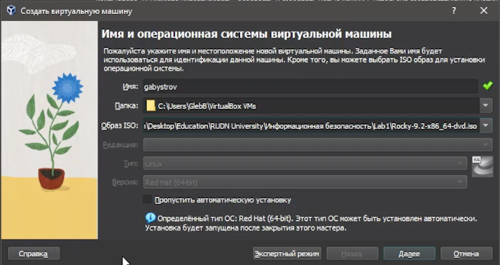

---
## Front matter
title: "Отчёт по лабораторной работе №1"
subtitle: "дисциплина: Информационная безопасность"
author: "Быстров Глеб Андреевич"

## Generic otions
lang: ru-RU
toc-title: "Содержание"

## Bibliography
bibliography: bib/cite.bib
csl: pandoc/csl/gost-r-7-0-5-2008-numeric.csl

## Pdf output format
toc: true # Table of contents
toc-depth: 2
lof: true # List of figures
lot: true # List of tables
fontsize: 12pt
linestretch: 1.5
papersize: a4
documentclass: scrreprt
## I18n polyglossia
polyglossia-lang:
  name: russian
  options:
	- spelling=modern
	- babelshorthands=true
polyglossia-otherlangs:
  name: english
## I18n babel
babel-lang: russian
babel-otherlangs: english
## Fonts
mainfont: PT Serif
romanfont: PT Serif
sansfont: PT Sans
monofont: PT Mono
mainfontoptions: Ligatures=TeX
romanfontoptions: Ligatures=TeX
sansfontoptions: Ligatures=TeX,Scale=MatchLowercase
monofontoptions: Scale=MatchLowercase,Scale=0.9
## Biblatex
biblatex: true
biblio-style: "gost-numeric"
biblatexoptions:
  - parentracker=true
  - backend=biber
  - hyperref=auto
  - language=auto
  - autolang=other*
  - citestyle=gost-numeric
## Pandoc-crossref LaTeX customization
figureTitle: "Рис."
tableTitle: "Таблица"
listingTitle: "Листинг"
lofTitle: "Список иллюстраций"
lotTitle: "Список таблиц"
lolTitle: "Листинги"
## Misc options
indent: true
header-includes:
  - \usepackage{indentfirst}
  - \usepackage{float} # keep figures where there are in the text
  - \floatplacement{figure}{H} # keep figures where there are in the text
---

# Цель работы

В данной лабораторной работе мне будет необходимо создать и настроить виртуальную машину, вспомнить как работать с git и разметкой Markdown для формирования отчётов по лабораторным работам.

# Задание

Создать и настроить рабочее пространство для лабораторных работ для данной дисциплины.

# Теоретическое введение

Git («гит») — это распределённая система управления версиями. Проект был создан Линусом Торвальдсом для управления разработкой ядра Linux, первая версия выпущена 7 апреля 2005 года. На сегодняшний день его поддерживает Джунио Хамано [@key-3].

Среди проектов, использующих Git — ядро Linux, Swift, Android, Drupal, Cairo, GNU Core Utilities, Mesa, Wine, Chromium, Compiz Fusion, FlightGear, jQuery, PHP, NASM, MediaWiki, DokuWiki, Qt, ряд дистрибутивов Linux.

Программа является свободной и выпущена под лицензией GNU GPL версии 2. По умолчанию используется TCP порт 9418.

Необходимо выполнить следующие команды, чтобы git узнал имя и
электронную почту. Если git уже установлен, можно переходить к разделу окончания строк [@key-1].

git config --global user.name "Your Name"

git config --global user.email "your_email@whatever.com"

Markdown («маркда́ун») — облегчённый язык разметки, созданный с целью обозначения форматирования в простом тексте, с максимальным сохранением его читаемости человеком, и пригодный для машинного преобразования в языки для продвинутых публикаций (HTML, Rich Text и других) [@key-4].

Чтобы создать заголовок, используйте знак (#), например:
#This is heading 1

##This is heading 2

###This is heading 3

####This is heading 4

Чтобы задать для текста полужирное начертание, заключите его в
двойные звездочки:
This text is ** bold **.

Чтобы задать для текста курсивное начертание, заключите его в
одинарные звездочки:
This text is * italic *.

Чтобы задать для текста полужирное и курсивное начертание, заключите его в тройные звездочки:
This is text is both *** bold and italic ***  [@key-2].

# Выполнение лабораторной работы

1. Создал каталоги со следующей структурой: ~/work/study/2022-2023/Математическое моделирование/mathmod/ (рис. @fig:001).

{ #fig:001 width=70%}

2. Создал репозиторий на основе шаблона (рис. @fig:002).

{ #fig:002 width=70%}

3. Создал SSH-ключ используя команду в Windows PowerShell (рис. @fig:003).

{ #fig:003 width=70%}

4. Добавил SSH-ключ на сайте https://github.com/ (рис. @fig:004).

{ #fig:004 width=70%}

5. Создал рекурсивный клон репозитория используя команду в Windows PowerShell (рис. @fig:005).

{ #fig:005 width=70%}

6. Создал каталоги для отчетов и презентаций к лабораторным работам и поместил в них файлы из шаблона (рис. @fig:006).

{ #fig:006 width=70%}

7. Отправил файлы на сервер, используя команды в Windows PowerShell (рис. @fig:007).

{ #fig:007 width=70%}

8. Удостоверился, что данные в репозитории были обновлены (рис. @fig:008).

{ #fig:008 width=70%}

9. Начал создавать новую виртуальную машину (рис. @fig:009).

{ #fig:009 width=70%}

10. Провел первоначальную конфигурацию (рис. @fig:010).

{ #fig:010 width=70%}

11. Добавил пользователя (рис. @fig:011).

{ #fig:011 width=70%}

12. Подключил образ диска (рис. @fig:012).

{ #fig:012 width=70%}

13. Перезагрузил систему и с помощью команд в терминале изучил информацию (рис. @fig:013).

{ #fig:013 width=70%}

# Домашнее задание

14. Дождитесь загрузки графического окружения и откройте терминал. В окне терминала проанализируйте последовательность загрузки системы, выполнив команду dmesg. Можно просто просмотреть вывод этой команды: dmesg | less (рис. @fig:014).

{ #fig:014 width=70%}

15. Версия ядра Linux (Linux version) (рис. @fig:015).

{ #fig:015 width=70%}

16. Частота процессора (Detected Mhz processor) (рис. @fig:016).

{ #fig:016 width=70%}

17. Модель процессора (CPU0) (рис. @fig:017).

{ #fig:017 width=70%}

18. Объем доступной оперативной памяти (Memory available) (рис. @fig:018).

{ #fig:018 width=70%}

19. Тип обнаруженного гипервизора (Hypervisor detected) (рис. @fig:019).

{ #fig:019 width=70%}

20. Тип файловой системы корневого раздела (рис. @fig:020).

{ #fig:020 width=70%}

# Контрольные вопросы

1. Какую информацию содержит учётная запись пользователя?

Когда пользователь регистрируется в системе (проходит процедуру авторизации, например, вводя системное имя и пароль), он идентифицируется с учётной записью, в которой система хранит информацию о каждом пользователе: его системное имя и некоторые другие сведения, необходимые для работы с ним. Именно с учётными записями, а не с самими пользователями, и работает система.

Системное имя (user name)
Это то имя, которое вводит пользователь в ответ на приглашение login:. 

Идентификатор пользователя (UID)
Linux связывает системное имя c идентификатором пользователя в системе — UID (User ID). UID — это положительное целое число, по которому система и отслеживает пользователей. 

Идентификатор группы (GID)
Кроме идентификационного номера пользователя с учётной записью связан идентификатор группы. Группы пользователей применяются для организации доступа нескольких пользователей к некоторым ресурсам. У группы, так же, как и у пользователя, есть имя и идентификационный номер — GID (Group ID). В Linux каждый пользователь должен принадлежать как минимум к одной группе — группе по умолчанию. 

Полное имя (full name)
Помимо системного имени в учётной записи содержится и полное имя (имя и фамилия) использующего данную учётную запись человека. 

Домашний каталог (home directory)
Файлы всех пользователей в Linux хранятся раздельно, у каждого пользователя есть собственный домашний каталог, в котором он может хранить свои данные. 

Начальная оболочка (login shell)
Начальная оболочка (login shell) запускается при входе пользователя в систему в текстовом режиме (например, на виртуальной консоли).

2. Укажите команды терминала и приведите примеры:

для получения справки по команде;

Команда man <название>
Пример: man mkdir

для перемещения по файловой системе;

Команда cd <название каталога>
Пример: cd photo

для просмотра содержимого каталога;

Команда ls <опция> <директория>
Пример: ls -ltr

для определения объёма каталога;

Команда du <параметр> <путь к элементу файловой системы>
Пример: “du /home/photo”

для создания / удаления каталогов / файлов;

Команда для создания каталогов - mkdir <опция> <имя директории>
Пример: mkdir video

Команда для создания файлов - touch <название файла>
Пример: touch 1.txt

Команда для удаления каталогов - rmdir <название каталога>
Пример: rmdir video

Команда для удаления файлов - rm <название файла>
Пример: rm 1.txt

для задания определённых прав на файл / каталог;

Команда chmod <ключи> <установка прав> <имя файла>
Пример: chmod 555 1.txt

для просмотра истории команд.

Команда history <количество команд>. 
Пример: history 7

3. Что такое файловая система? Приведите примеры с краткой характеристикой.

Файловая система – это порядок, определяющий организацию, хранение, именование данных на определенном носителе информации или его логическом разделе. В качестве примера можно привести файловые системы Windows и Linux. Структура директорий Linux не просто использует другие имена для папок, а использует совершенно другие "шаблоны". 

4. Как посмотреть, какие файловые системы подмонтированы в ОС?

Необходимо ввести в терминал команду “mount”. Пример: mount

5. Как удалить зависший процесс?

После нахождения идентификатора (PID) зависшего процесса мы можем убить его командой kill <номер процесса>. Пример: kill 12345

# Выводы

В данной лабораторной работе мне успешно удалось создать и настроить рабочее пространство для лабораторных работ.

# Список литературы{.unnumbered}

::: {#refs}
:::
