---
## Front matter
lang: ru-RU
title: Отчёт по лабораторной работе №2
author: |
	Быстров Г. А.
institute: |
	Российский университет дружбы народов, Москва, Россия
date: 16 сентября 2023

## Formatting
toc: false
slide_level: 2
theme: metropolis
header-includes: 
 - \metroset{progressbar=frametitle,sectionpage=progressbar,numbering=fraction}
 - '\makeatletter'
 - '\beamer@ignorenonframefalse'
 - '\makeatother'
aspectratio: 43
section-titles: true
---

## Прагматика

- научиться настраивать права доступа и работать с атрибутами файлов;
- получить практические знания работы с ОС Linux;
- решить возникающие трудности и проблемы;
- практически получить полезный результат.

## Цель работы

В данной лабораторной работе мне будет необходимо получить практические навыки работы в консоли с атрибутами файлов, закрепить теоретические основы дискреционного разграничения доступа в современных системах с открытым кодом на базе ОС Linux.

## Задачи

1. Создал учётную запись пользователя guest и задал пароль для пользователя (рис. \ref{1}).

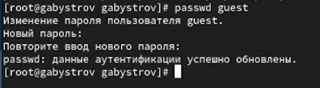{ width=70% }

## Задачи

2. Вошёл в систему от имени пользователя guest (рис. \ref{2}).

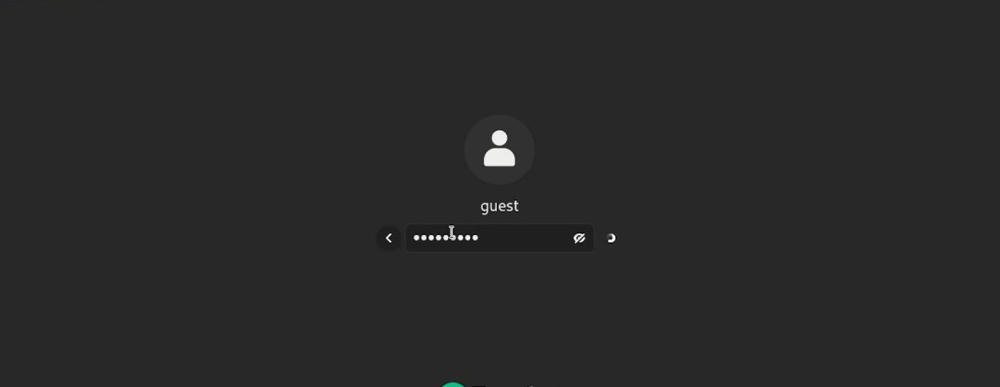{ width=70% }

## Задачи

3. Уточнил имя пользователя, его группу, а также группы, куда входит пользователь, командой id. Также использовал groups  (рис. \ref{3}).

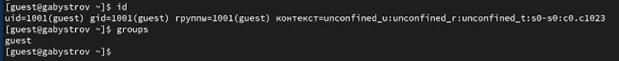{ width=70% }

## Задачи

4. Просмотел файл /etc/passwd командой cat /etc/passwd. Нашёл в нём свою учётную запись. Определил uid пользователя (1001). Определил gid пользователя (1001). Найденные значения совпадают с полученными в предыдущих пунктах (рис. \ref{4}).

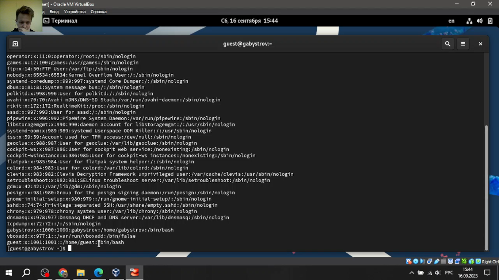{ width=70% }

## Задачи

5. Определил существующие в системе директории командой ls -l /home/. Удалось получить список поддиректорий директории /home. На директориях установлены права для чтения, записи и выполнения только для пользователя (рис. \ref{5}).

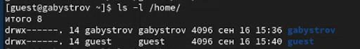{ width=70% }

## Задачи

6. Проверил какие расширенные атрибуты установлены на поддиректориях, находящихся в директории /home, командой: lsattr /home. Удалось увидеть расширенные атрибуты директории только для пользователя. Не удалось увидеть расширенные атрибуты директорий других пользователей (рис. \ref{6}).

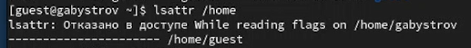{ width=70% }

## Задачи

7. Создал в домашней директории поддиректорию dir1 командой mkdir dir1. Определил командами ls -l и lsattr, какие права доступа и расширенные атрибуты были выставлены на директорию dir1: чтение, запись и выполнение для пользователя и групп. Чтение и выполнение для остальных. Расширенных атрибутов нет (рис. \ref{7}).

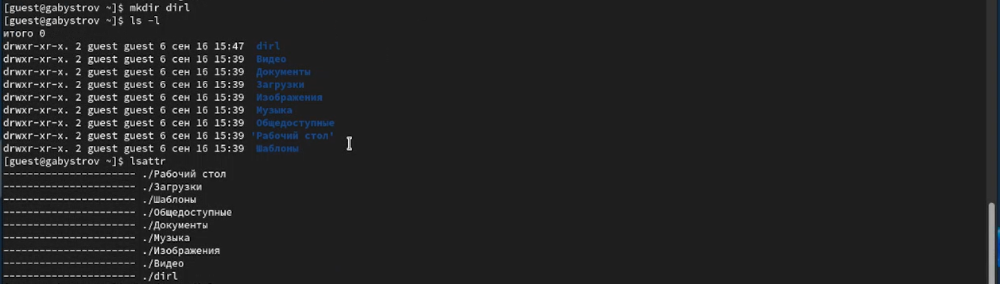{ width=70% }

## Задачи

8. Снял с директории dir1 все атрибуты командой chmod 000 dir1 и проверил с её помощью правильность выполнения команды ls -l. Все было верно (рис. \ref{8}).

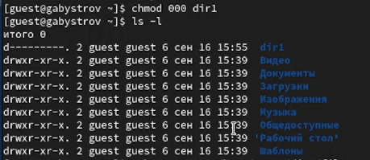{ width=70% }

## Задачи

9. Попытался создать в директории dir1 файл file1 командой echo "test" > /home/guest/dir1/file1. Получил отказ в выполнении операции по созданию файла так как до этого убрал данное право. Оценил, как сообщение об ошибке отразилось на создании файла. Файл не создался. Проверил командой ls -l /home/guest/dir1 действительно ли файл file1 не находится внутри директории dir1 (рис. \ref{9}).

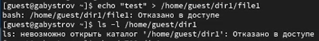{ width=70% }

## Задачи

10. Заполнил таблицу «Установленные права и разрешённые действия», выполняя действия от имени владельца директории (файлов), определив опытным путём, какие операции разрешены, а какие нет. Если операция разрешена, занес в таблицу знак «+», если не разрешена, знак «-» (рис. \ref{10}).

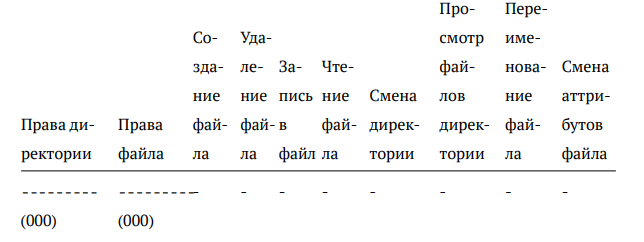{ width=70% }

## Задачи

11. На основании заполненной таблицы определил те или иные минимально необходимые права для выполнения операций внутри директории dir1, заполнил таблицу (рис. \ref{11}).

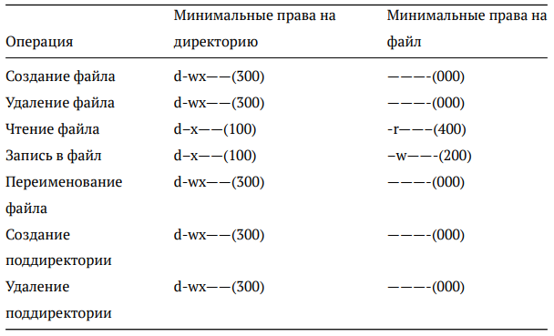{ width=70% }

## Результаты

- научился работы в консоли с атрибутами файлов;
- закрепить теоретические основы дискреционного разграничения доступа в современных системах с открытым кодом на базе ОС Linux;