---
## Front matter
title: "Отчёт по лабораторной работе №2"
subtitle: "дисциплина: Информационная безопасность"
author: "Быстров Глеб Андреевич"

## Generic otions
lang: ru-RU
toc-title: "Содержание"

## Bibliography
bibliography: bib/cite.bib
csl: pandoc/csl/gost-r-7-0-5-2008-numeric.csl

## Pdf output format
toc: true # Table of contents
toc-depth: 2
lof: true # List of figures
lot: true # List of tables
fontsize: 12pt
linestretch: 1.5
papersize: a4
documentclass: scrreprt
## I18n polyglossia
polyglossia-lang:
  name: russian
  options:
	- spelling=modern
	- babelshorthands=true
polyglossia-otherlangs:
  name: english
## I18n babel
babel-lang: russian
babel-otherlangs: english
## Fonts
mainfont: PT Serif
romanfont: PT Serif
sansfont: PT Sans
monofont: PT Mono
mainfontoptions: Ligatures=TeX
romanfontoptions: Ligatures=TeX
sansfontoptions: Ligatures=TeX,Scale=MatchLowercase
monofontoptions: Scale=MatchLowercase,Scale=0.9
## Biblatex
biblatex: true
biblio-style: "gost-numeric"
biblatexoptions:
  - parentracker=true
  - backend=biber
  - hyperref=auto
  - language=auto
  - autolang=other*
  - citestyle=gost-numeric
## Pandoc-crossref LaTeX customization
figureTitle: "Рис."
tableTitle: "Таблица"
listingTitle: "Листинг"
lofTitle: "Список иллюстраций"
lotTitle: "Список таблиц"
lolTitle: "Листинги"
## Misc options
indent: true
header-includes:
  - \usepackage{indentfirst}
  - \usepackage{float} # keep figures where there are in the text
  - \floatplacement{figure}{H} # keep figures where there are in the text
---

# Цель работы

В данной лабораторной работе мне будет необходимо получить практические навыки работы в консоли с атрибутами файлов, закрепить теоретические основы дискреционного разграничения доступа в современных системах с открытым кодом на базе ОС Linux.

# Задание

Последовательно выполнить пункты по настройке доступа через команды в терминале для нового пользователя.

# Теоретическое введение

В Linux у каждого файла и каждого каталога есть два владельца: пользователь и группа.

Эти владельцы устанавливаются при создании файла или каталога. Пользователь, который создаёт файл становится владельцем этого файла, а первичная группа, в которую входит этот же пользователь, так же становится владельцем этого файла. Чтобы определить, есть ли у вас как у пользователя права доступа к файлу или каталогу, оболочка проверяет владение ими. [@key-1].

Выделяют три категории пользователей, которым могут предоставляться права на файл:

* Сам владелец (u – user) объекта – конкретный пользователь, чье имя числится в атрибутах файла как имя владельца этого файла. Обычно если пользователь создает файл, то он автоматически записывается как его владелец.

* Группа (g – group), к которой принадлежит владелец файла. Когда в Linux создается пользователь, то для него создается одноименная группа. Однако средствами администрирования системы можно объединять пользователей в различные группы. При этом конкретный пользователь может входить в состав нескольких групп. Группы позволяют предоставлять права доступа к ресурсам сразу нескольким людям, но при этом ограниченному кругу лиц.

* Все остальные (o – other) – это все те, кто не является владельцем файла и не принадлежит к группе владельца файла. То есть любой посторонний пользователь. 

Чтение, запись, выполнение – это то, что можно делать с существующим файлом, возможные действия над ним. У каждой категории пользователей (владельца, группы, остальных) должны быть свои права на каждое вышеупомянутое действие.

* Право на чтение (r – read) означает, что файл можно просматривать. Например, открыть файл и, если он текстовый, прочитать содержащийся в нем текст. Если это файл изображения, то можно посмотреть изображение. Наличие права только на чтение не позволяет изменять файл. То есть нельзя будет исправить текст или подрисовать что-то к картинке.

* Право на запись (w – write) позволяет изменять файл, то есть дописывать в него информацию или заменять ее другой.

* Право на исполнение (x – execution) имеет смысл не для всех файлов, хотя может быть установлено для любого. Это право позволяет исполнять файл как программу, при этом в файле должны быть записаны инструкции для процессора, то есть файл должен быть исполняемой программой.

Первые три записи – это права владельца, вторые три записи – права группы, последняя тройка – права на файл для всех остальных. Если обозначить каждое право соответствующей буквой, и все права всем предоставляются, то получится такая запись: rwxrwxrwx [@key-2].

Рассмотрим подробнее, что значат условные значения флагов прав:

--- - нет прав, совсем;

--x - разрешено только выполнение файла, как программы но не изменение и не чтение;

-w- - разрешена только запись и изменение файла;

-wx - разрешено изменение и выполнение, но в случае с каталогом, вы не можете посмотреть его содержимое;

r-- - права только на чтение;

r-x - только чтение и выполнение, без права на запись;

rw- - права на чтение и запись, но без выполнения;

rwx - все права;

--s - установлен SUID или SGID бит, первый отображается в поле для владельца, второй для группы;

--t - установлен sticky-bit, а значит пользователи не могут удалить этот файл [@key-3].

Использование команды ls с опцией -l выведет на экран «длинную» распечатку, в которой будут, среди прочего, отражены права доступа к файлу [@key-4].

# Выполнение лабораторной работы

1. В установленной при выполнении предыдущей лабораторной работы операционной системе создал учётную запись пользователя guest (использовал учётную запись администратора): useradd guest (рис. @fig:001).

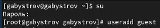{ #fig:001 width=70%}

2. Задал пароль для пользователя guest (использовал учётную запись администратора): passwd guest (рис. @fig:002).

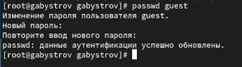{ #fig:002 width=70%}

3. Вошёл в систему от имени пользователя guest (рис. @fig:003).

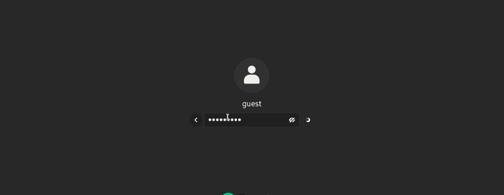{ #fig:003 width=70%}

4. Определил директорию, в которой нахожусь, командой pwd. С приглашением командной строки совпадает. Является домашней директорией (рис. @fig:004).

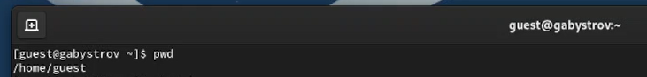{ #fig:004 width=70%}

5. Уточнил имя пользователя командой whoami. (рис. @fig:005).

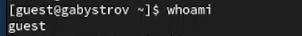{ #fig:005 width=70%}

6. Уточнил имя пользователя, его группу, а также группы, куда входит пользователь, командой id. Выведенные значения с выводом команды groups совпадают (рис. @fig:006).

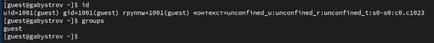{ #fig:006 width=70%}

7. Полученная информация об имени пользователя с данными, выводимыми в приглашении командной строки совпадает (рис. @fig:007).

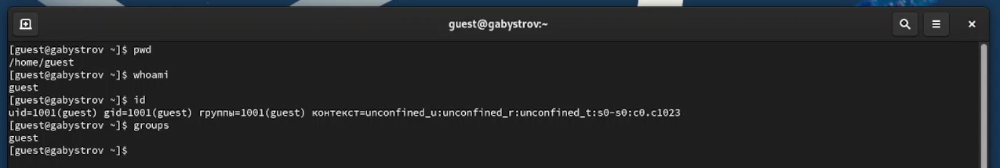{ #fig:007 width=70%}

8. Просмотел файл /etc/passwd командой cat /etc/passwd. Нашёл в нём свою учётную запись. Определил uid пользователя (1001). Определил gid пользователя (1001). Найденные значения совпадают с полученными в предыдущих пунктах (рис. @fig:008).

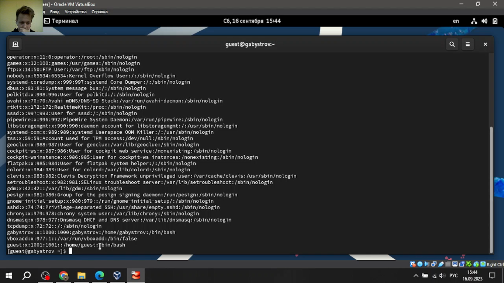{ #fig:008 width=70%}

9. Определил существующие в системе директории командой ls -l /home/. Удалось получить список поддиректорий директории /home. На директориях установлены права для чтения, записи и выполнения только для пользователя (рис. @fig:009).

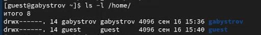{ #fig:009 width=70%}

10. Проверил какие расширенные атрибуты установлены на поддиректориях, находящихся в директории /home, командой: lsattr /home. Удалось увидеть расширенные атрибуты директории только для пользователя. Не удалось увидеть расширенные атрибуты директорий других пользователей (рис. @fig:010).

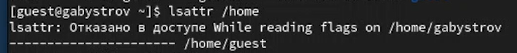{ #fig:010 width=70%}

11. Создал в домашней директории поддиректорию dir1 командой mkdir dir1. Определил командами ls -l и lsattr, какие права доступа и расширенные атрибуты были выставлены на директорию dir1: чтение, запись и выполнение для пользователя и групп. Чтение и выполнение для остальных. Расширенных атрибутов нет (рис. @fig:011).

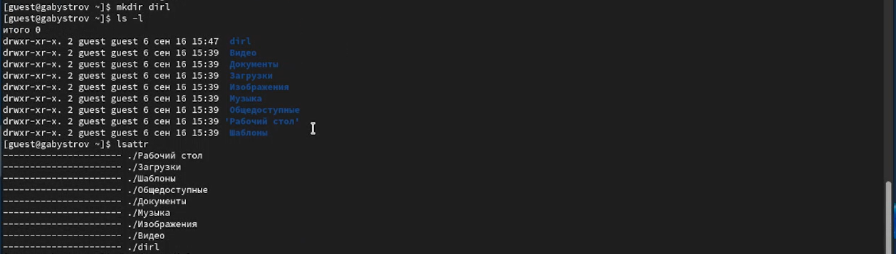{ #fig:011 width=70%}

12. Снял с директории dir1 все атрибуты командой chmod 000 dir1 и проверил с её помощью правильность выполнения команды ls -l. Все было верно(рис. @fig:012).

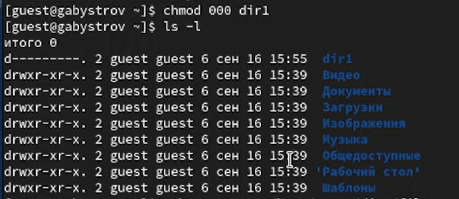{ #fig:012 width=70%}

13. Попытался создать в директории dir1 файл file1 командой echo "test" > /home/guest/dir1/file1. Получил отказ в выполнении операции по созданию файла так как до этого убрал данное право. Оценил, как сообщение об ошибке отразилось на создании файла. Файл не создался. Проверил командой ls -l /home/guest/dir1 действительно ли файл file1 не находится внутри директории dir1. (рис. @fig:013).

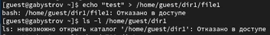{ #fig:013 width=70%}

14. Заполнил таблицу «Установленные права и разрешённые действия», выполняя действия от имени владельца директории (файлов), определив опытным путём, какие операции разрешены, а какие нет. Если операция разрешена, занес в таблицу знак «+», если не разрешена, знак «-».

: Установленные права и разрешенные действия {#tbl:01}

|Права директории|Права файла|Создание файла|Удаление файла|Запись в файл|Чтение файла|Смена директории|Просмотр файлов директории|Переименование файла|Смена аттрибутов файла|
|------------------|-------------|-------|-----|------|-------|------------|-----------|---------|------------|
|```---------``` (000)|```---------``` (000)| - | - | - | - | - | - | - | - |
|```---------``` (000)|```--x------``` (100)| - | - | - | - | - | - | - | - |
|```---------``` (000)|```-w-------``` (200)| - | - | - | - | - | - | - | - |
|```---------``` (000)|```-wx------``` (300)| - | - | - | - | - | - | - | - |
|```---------``` (000)|```r--------``` (400)| - | - | - | - | - | - | - | - |
|```---------``` (000)|```r-x------``` (500)| - | - | - | - | - | - | - | - |
|```---------``` (000)|```rw-------``` (600)| - | - | - | - | - | - | - | - |
|```---------``` (000)|```rwx------``` (700)| - | - | - | - | - | - | - | - |
|```--x------``` (100)|```---------``` (000)| - | - | - | - | + | - | - | - |
|```--x------``` (100)|```--x------``` (100)| - | - | - | - | + | - | - | - |
|```--x------``` (100)|```-w-------``` (200)| - | - | + | - | + | - | - | - |
|```--x------``` (100)|```-wx------``` (300)| - | - | + | - | + | - | - | - |
|```--x------``` (100)|```r--------``` (400)| - | - | - | + | + | - | - | + |
|```--x------``` (100)|```r-x------``` (500)| - | - | - | + | + | - | - | + |
|```--x------``` (100)|```rw-------``` (600)| - | - | + | + | + | - | - | + |
|```--x------``` (100)|```rwx------``` (700)| - | - | + | + | + | - | - | + |
|```-w-------``` (200)|```---------``` (000)| - | - | - | - | - | - | - | - |
|```-w-------``` (200)|```--x------``` (100)| - | - | - | - | - | - | - | - |
|```-w-------``` (200)|```-w-------``` (200)| - | - | - | - | - | - | - | - |
|```-w-------``` (200)|```-wx------``` (300)| - | - | - | - | - | - | - | - |
|```-w-------``` (200)|```r--------``` (400)| - | - | - | - | - | - | - | - |
|```-w-------``` (200)|```r-x------``` (500)| - | - | - | - | - | - | - | - |
|```-w-------``` (200)|```rw-------``` (600)| - | - | - | - | - | - | - | - |
|```-w-------``` (200)|```rwx------``` (700)| - | - | - | - | - | - | - | - |
|```-wx------``` (300)|```---------``` (000)| + | + | - | - | + | - | + | - |
|```-wx------``` (300)|```--x------``` (100)| + | + | - | - | + | - | + | - |
|```-wx------``` (300)|```-w-------``` (200)| + | + | + | - | + | - | + | - |
|```-wx------``` (300)|```-wx------``` (300)| + | + | + | - | + | - | + | - |
|```-wx------``` (300)|```r--------``` (400)| + | + | - | + | + | - | + | + |
|```-wx------``` (300)|```r-x------``` (500)| + | + | - | + | + | - | + | + |
|```-wx------``` (300)|```rw-------``` (600)| + | + | + | + | + | - | + | + |
|```-wx------``` (300)|```rwx------``` (700)| + | + | + | + | + | - | + | + |
|```r--------``` (400)|```---------``` (000)| - | - | - | - | - | + | - | - |
|```r--------``` (400)|```--x------``` (100)| - | - | - | - | - | + | - | - |
|```r--------``` (400)|```-w-------``` (200)| - | - | - | - | - | + | - | - |
|```r--------``` (400)|```-wx------``` (300)| - | - | - | - | - | + | - | - |
|```r--------``` (400)|```r--------``` (400)| - | - | - | - | - | + | - | - |
|```r--------``` (400)|```r-x------``` (500)| - | - | - | - | - | + | - | - |
|```r--------``` (400)|```rw-------``` (600)| - | - | - | - | - | + | - | - |
|```r--------``` (400)|```rwx------``` (700)| - | - | - | - | - | + | - | - |
|```r-x------``` (500)|```---------``` (000)| - | - | - | - | + | + | - | - |
|```r-x------``` (500)|```--x------``` (100)| - | - | - | - | + | + | - | - |
|```r-x------``` (500)|```-w-------``` (200)| - | - | + | - | + | + | - | - |
|```r-x------``` (500)|```-wx------``` (300)| - | - | + | - | + | + | - | - |
|```r-x------``` (500)|```r--------``` (400)| - | - | - | + | + | + | - | + |
|```r-x------``` (500)|```r-x------``` (500)| - | - | - | + | + | + | - | + |
|```r-x------``` (500)|```rw-------``` (600)| - | - | + | + | + | + | - | + |
|```r-x------``` (500)|```rwx------``` (700)| - | - | + | + | + | + | - | + |
|```rw-------``` (600)|```---------``` (000)| - | - | - | - | - | + | - | - |
|```rw-------``` (600)|```--x------``` (100)| - | - | - | - | - | + | - | - |
|```rw-------``` (600)|```-w-------``` (200)| - | - | - | - | - | + | - | - |
|```rw-------``` (600)|```-wx------``` (300)| - | - | - | - | - | + | - | - |
|```rw-------``` (600)|```r--------``` (400)| - | - | - | - | - | + | - | - |
|```rw-------``` (600)|```r-x------``` (500)| - | - | - | - | - | + | - | - |
|```rw-------``` (600)|```rw-------``` (600)| - | - | - | - | - | + | - | - |
|```rw-------``` (600)|```rwx------``` (700)| - | - | - | - | - | + | - | - |
|```rwx------``` (700)|```---------``` (000)| + | + | - | - | + | + | + | - |
|```rwx------``` (700)|```--x------``` (100)| + | + | - | - | + | + | + | - |
|```rwx------``` (700)|```-w-------``` (200)| + | + | + | - | + | + | + | - |
|```rwx------``` (700)|```-wx------``` (300)| + | + | + | - | + | + | + | - |
|```rwx------``` (700)|```r--------``` (400)| + | + | - | + | + | + | + | + |
|```rwx------``` (700)|```r-x------``` (500)| + | + | - | + | + | + | + | + |
|```rwx------``` (700)|```rw-------``` (600)| + | + | + | + | + | + | + | + |
|```rwx------``` (700)|```rwx------``` (700)| + | + | + | + | + | + | + | + |

15. На основании заполненной таблицы определил те или иные минимально необходимые права для выполнения операций внутри директории dir1, заполнил таблицу.

: Минимальные права для совершения операций {#tbl:02}

|Операция                |Минимальные права на директорию|Минимальные права на файл|
|------------------------|-------------------------------|-------------------------|
|Создание файла          |d-wx------(300)                |----------(000)          |
|Удаление файла          |d-wx------(300)                |----------(000)          |
|Чтение файла            |d--x------(100)                |-r--------(400)          |
|Запись в файл           |d--x------(100)                |--w-------(200)          |
|Переименование файла    |d-wx------(300)                |----------(000)          |
|Создание поддиректории  |d-wx------(300)                |----------(000)          |
|Удаление поддиректории  |d-wx------(300)                |----------(000)          |

# Выводы

В данной лабораторной работе мне успешно удалось получить практические навыки работы в консоли с атрибутами файлов, закрепить теоретические основы дискреционного разграничения доступа в современных системах с открытым кодом на базе ОС Linux.

# Список литературы{.unnumbered}

::: {#refs}
:::
