---
## Front matter
lang: ru-RU
title: Отчёт по лабораторной работе №3
author: |
	Быстров Г. А.
institute: |
	Российский университет дружбы народов, Москва, Россия
date: 23 сентября 2023

## Formatting
toc: false
slide_level: 2
theme: metropolis
header-includes: 
 - \metroset{progressbar=frametitle,sectionpage=progressbar,numbering=fraction}
 - '\makeatletter'
 - '\beamer@ignorenonframefalse'
 - '\makeatother'
aspectratio: 43
section-titles: true
---

## Прагматика

- научиться настраивать группы пользователей;
- получить практические знания работы с ОС Linux;
- решить возникающие трудности и проблемы;
- практически получить полезный результат.

## Цель работы

Получить практические навыки работы в консоли с атрибутами файлов для групп пользователей.

## Задачи

1. В установленной операционной системе создал учётную запись пользователя guest2 (рис. \ref{1}).

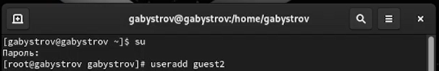{ width=70% }

## Задачи

2. Задал пароль для пользователя guest2 (рис. \ref{2}).

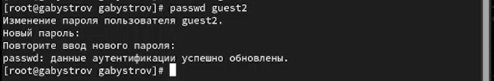{ width=70% }

## Задачи

3. Добавил пользователя guest2 в группу guest (рис. \ref{3}).

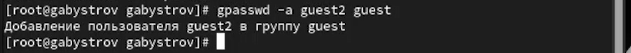{ width=70% }

## Задачи

4. Осуществил вход в систему от двух пользователей на двух разных консолях (рис. \ref{4}).

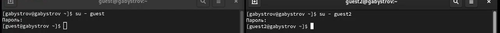{ width=70% }

## Задачи

5. Для обоих пользователей командой pwd определил директорию, в которой нахожусь. Сравнил её с приглашениями командной строки (рис. \ref{5}).

{ width=70% }

## Задачи

6. Уточнил имя моего пользователя, его группу, кто входит в неё и к каким группам принадлежит он сам. Определил командами groups guest и groups guest2, в какие группы входят пользователи guest и guest2. Сравнил вывод команды groups с выводом команд id -Gn и id -G. (рис. \ref{6}).

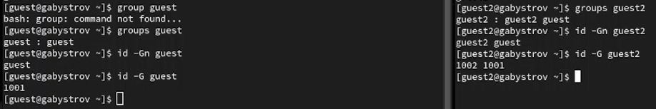{ width=70% }

## Задачи

7. Сравнил полученную информацию с содержимым файла /etc/group (рис. \ref{7}).

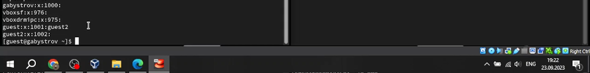{ width=70% }

## Задачи

8. От имени пользователя guest2 выполнил регистрацию пользователя guest2 в группе guest (рис. \ref{8}).

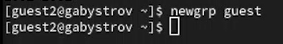{ width=70% }

## Задачи

9. От имени пользователя guest изменил права директории /home/guest, разрешив все действия для пользователей группы (рис. \ref{9}).

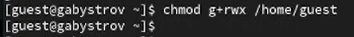{ width=70% }

## Задачи

10. От имени пользователя guest снял с директории /home/guest/dir1 все атрибуты командой chmod 000 dirl и проверил правильность снятия атрибутов (рис. \ref{10}).

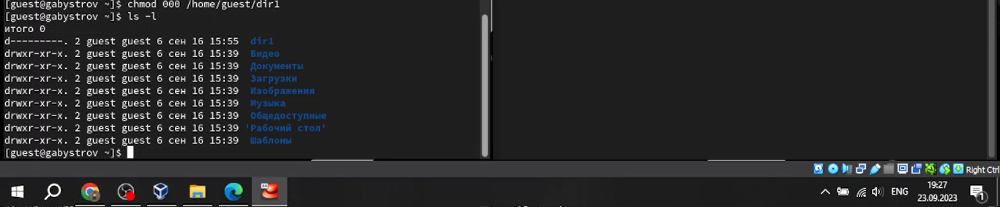{ width=70% }

## Задачи

11. Меняя атрибуты у директории dir1 и файла file1 от имени пользователя guest и делая проверку от пользователя guest2, заполнил таблицу (рис. \ref{11}).

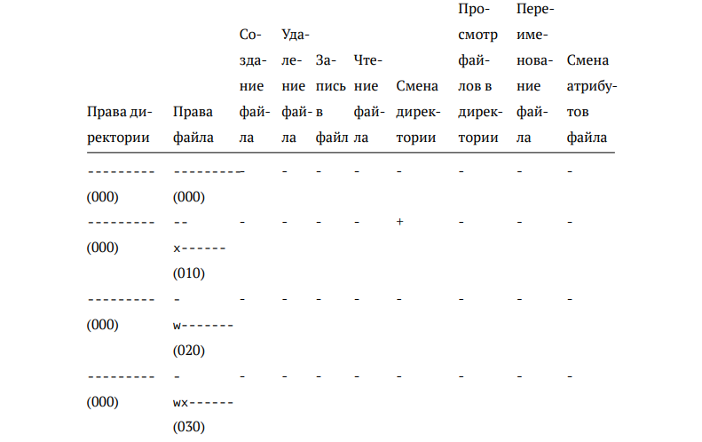{ width=70% }

## Задачи

12. На основании заполненной таблицы определил те или иные минимально необходимые права для выполнения пользователем guest2 операций
внутри директории dir1 и заполнил таблицу (рис. \ref{12}).

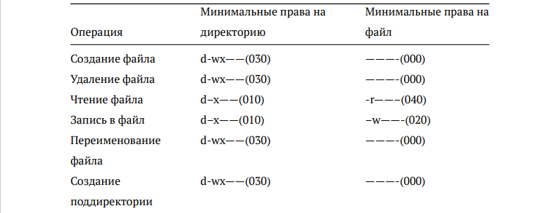{ width=70% }

## Результаты

- научился работы в консоли с группами пользователей.