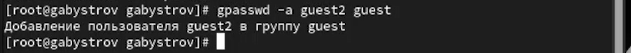

---
## Front matter
title: "Отчёт по лабораторной работе №3"
subtitle: "дисциплина: Информационная безопасность"
author: "Быстров Глеб Андреевич"

## Generic otions
lang: ru-RU
toc-title: "Содержание"

## Bibliography
bibliography: bib/cite.bib
csl: pandoc/csl/gost-r-7-0-5-2008-numeric.csl

## Pdf output format
toc: true # Table of contents
toc-depth: 2
lof: true # List of figures
lot: true # List of tables
fontsize: 12pt
linestretch: 1.5
papersize: a4
documentclass: scrreprt
## I18n polyglossia
polyglossia-lang:
  name: russian
  options:
	- spelling=modern
	- babelshorthands=true
polyglossia-otherlangs:
  name: english
## I18n babel
babel-lang: russian
babel-otherlangs: english
## Fonts
mainfont: PT Serif
romanfont: PT Serif
sansfont: PT Sans
monofont: PT Mono
mainfontoptions: Ligatures=TeX
romanfontoptions: Ligatures=TeX
sansfontoptions: Ligatures=TeX,Scale=MatchLowercase
monofontoptions: Scale=MatchLowercase,Scale=0.9
## Biblatex
biblatex: true
biblio-style: "gost-numeric"
biblatexoptions:
  - parentracker=true
  - backend=biber
  - hyperref=auto
  - language=auto
  - autolang=other*
  - citestyle=gost-numeric
## Pandoc-crossref LaTeX customization
figureTitle: "Рис."
tableTitle: "Таблица"
listingTitle: "Листинг"
lofTitle: "Список иллюстраций"
lotTitle: "Список таблиц"
lolTitle: "Листинги"
## Misc options
indent: true
header-includes:
  - \usepackage{indentfirst}
  - \usepackage{float} # keep figures where there are in the text
  - \floatplacement{figure}{H} # keep figures where there are in the text
---

# Цель работы

В данной лабораторной работе мне будет необходимо получить практические навыки работы в консоли с атрибутами файлов для групп пользователей.

# Задание

Последовательно выполнить пункты по настройке доступа через команды в терминале для двух пользователей.

# Теоретическое введение

В Linux у каждого файла и каждого каталога есть два владельца: пользователь и группа.

Эти владельцы устанавливаются при создании файла или каталога. Пользователь, который создаёт файл становится владельцем этого файла, а первичная группа, в которую входит этот же пользователь, так же становится владельцем этого файла. Чтобы определить, есть ли у вас как у пользователя права доступа к файлу или каталогу, оболочка проверяет владение ими. [@key-1].

Выделяют три категории пользователей, которым могут предоставляться права на файл:

* Сам владелец (u – user) объекта – конкретный пользователь, чье имя числится в атрибутах файла как имя владельца этого файла. Обычно если пользователь создает файл, то он автоматически записывается как его владелец.

* Группа (g – group), к которой принадлежит владелец файла. Когда в Linux создается пользователь, то для него создается одноименная группа. Однако средствами администрирования системы можно объединять пользователей в различные группы. При этом конкретный пользователь может входить в состав нескольких групп. Группы позволяют предоставлять права доступа к ресурсам сразу нескольким людям, но при этом ограниченному кругу лиц.

* Все остальные (o – other) – это все те, кто не является владельцем файла и не принадлежит к группе владельца файла. То есть любой посторонний пользователь. 

Чтение, запись, выполнение – это то, что можно делать с существующим файлом, возможные действия над ним. У каждой категории пользователей (владельца, группы, остальных) должны быть свои права на каждое вышеупомянутое действие.

* Право на чтение (r – read) означает, что файл можно просматривать. Например, открыть файл и, если он текстовый, прочитать содержащийся в нем текст. Если это файл изображения, то можно посмотреть изображение. Наличие права только на чтение не позволяет изменять файл. То есть нельзя будет исправить текст или подрисовать что-то к картинке.

* Право на запись (w – write) позволяет изменять файл, то есть дописывать в него информацию или заменять ее другой.

* Право на исполнение (x – execution) имеет смысл не для всех файлов, хотя может быть установлено для любого. Это право позволяет исполнять файл как программу, при этом в файле должны быть записаны инструкции для процессора, то есть файл должен быть исполняемой программой.

Первые три записи – это права владельца, вторые три записи – права группы, последняя тройка – права на файл для всех остальных. Если обозначить каждое право соответствующей буквой, и все права всем предоставляются, то получится такая запись: rwxrwxrwx [@key-2].

Рассмотрим подробнее, что значат условные значения флагов прав:

--- - нет прав, совсем;

--x - разрешено только выполнение файла, как программы но не изменение и не чтение;

-w- - разрешена только запись и изменение файла;

-wx - разрешено изменение и выполнение, но в случае с каталогом, вы не можете посмотреть его содержимое;

r-- - права только на чтение;

r-x - только чтение и выполнение, без права на запись;

rw- - права на чтение и запись, но без выполнения;

rwx - все права;

--s - установлен SUID или SGID бит, первый отображается в поле для владельца, второй для группы;

--t - установлен sticky-bit, а значит пользователи не могут удалить этот файл [@key-3].

Использование команды ls с опцией -l выведет на экран «длинную» распечатку, в которой будут, среди прочего, отражены права доступа к файлу [@key-4].

Все группы, созданные в системе, находятся в файле /etc/group. Посмотрев содержимое этого файла, вы можете узнать список групп linux, которые уже есть в вашей системе.

Кроме стандартных root и users, здесь есть еще пару десятков групп. Это группы, созданные программами, для управления доступом этих программ к общим ресурсам. Каждая группа разрешает чтение или запись определенного файла или каталога системы, тем самым регулируя полномочия пользователя, а следовательно, и процесса, запущенного от этого пользователя. Здесь можно считать, что пользователь - это одно и то же что процесс, потому что у процесса все полномочия пользователя, от которого он запущен [@key-5]. 

# Выполнение лабораторной работы

1. В установленной операционной системе создал учётную запись пользователя guest2 (использовал учётную запись администратора): useradd guest2 (рис. @fig:001).

{ #fig:001 width=70%}

2. Задал пароль для пользователя guest2 (использовал учётную запись администратора): passwd guest2 (рис. @fig:002).

{ #fig:002 width=70%}

3. Добавил пользователя guest2 в группу guest: gpasswd -a guest2 guest (рис. @fig:003).

{ #fig:003 width=70%}

4. Осуществил вход в систему от двух пользователей на двух разных консолях: guest на первой консоли и guest2 на второй консоли (рис. @fig:004).

{ #fig:004 width=70%}

5. Для обоих пользователей командой pwd определил директорию, в которой нахожусь. Сравнил её с приглашениями командной строки (рис. @fig:005).

{ #fig:005 width=70%}

6. Уточнил имя моего пользователя, его группу, кто входит в неё и к каким группам принадлежит он сам. Определил командами groups guest и groups guest2, в какие группы входят пользователи guest и guest2. Сравнил вывод команды groups с выводом команд id -Gn и id -G. (рис. @fig:006).

{ #fig:006 width=70%}

7. Сравнил полученную информацию с содержимым файла /etc/group. Просмотрел файл командой cat /etc/group (рис. @fig:007).

{ #fig:007 width=70%}

8. От имени пользователя guest2 выполнил регистрацию пользователя guest2 в группе guest командой newgrp guest (рис. @fig:008).

{ #fig:008 width=70%}

9. От имени пользователя guest изменил права директории /home/guest, разрешив все действия для пользователей группы: chmod g+rwx /home/guest (рис. @fig:009).

{ #fig:009 width=70%}

10. От имени пользователя guest снял с директории /home/guest/dir1 все атрибуты командой chmod 000 dirl и проверил правильность снятия атрибутов (рис. @fig:010).

{ #fig:010 width=70%}

11. Меняя атрибуты у директории dir1 и файла file1 от имени пользователя guest и делая проверку от пользователя guest2, заполнил табл. 3.1,
определив опытным путём, какие операции разрешены, а какие нет. Если операция разрешена, занес в таблицу знак «+», если не разрешена,
знак «-». Сравнил табл. 2.1 (из лабораторной работы № 2) и табл. 3.1.

: Установленные права и разрешенные действия для групп {#tbl:01}

|Права директории|Права файла|Создание файла|Удаление файла|Запись в файл|Чтение файла|Смена директории|Просмотр файлов в директории|Переименование файла|Смена атрибутов файла|
|------------------|-------------|-------|-----|------|-------|------------|-----------|---------|------------|
|```---------``` (000)|```---------``` (000)| - | - | - | - | - | - | - | - |
|```---------``` (000)|```--x------``` (010)| - | - | - | - | + | - | - | - |
|```---------``` (000)|```-w-------``` (020)| - | - | - | - | - | - | - | - |
|```---------``` (000)|```-wx------``` (030)| - | - | - | - | - | - | - | - |
|```---------``` (000)|```r--------``` (040)| - | - | - | - | - | - | - | - |
|```---------``` (000)|```r-x------``` (050)| - | - | - | - | - | - | - | - |
|```---------``` (000)|```rw-------``` (060)| - | - | - | - | - | - | - | - |
|```---------``` (000)|```rwx------``` (070)| - | - | - | - | - | - | - | - |
|```--x------``` (010)|```--x------``` (010)| - | - | - | - | + | - | - | - |
|```--x------``` (010)|```-w-------``` (020)| - | - | + | - | + | - | - | - |
|```--x------``` (010)|```-wx------``` (030)| - | - | + | - | + | - | - | - |
|```--x------``` (010)|```r--------``` (040)| - | - | - | + | + | - | - | - |
|```--x------``` (010)|```r-x------``` (050)| - | - | - | + | + | - | - | - |
|```--x------``` (010)|```rw-------``` (060)| - | - | + | + | + | - | - | - |
|```--x------``` (010)|```rwx------``` (070)| - | - | + | + | + | - | - | - |
|```--x------``` (010)|```---------``` (000)| - | - | - | - | + | - | - | - |
|```-w-------``` (020)|```---------``` (000)| - | - | - | - | - | - | - | - |
|```-w-------``` (020)|```--x------``` (010)| - | - | - | - | - | - | - | - |
|```-w-------``` (020)|```-w-------``` (020)| - | - | - | - | - | - | - | - |
|```-w-------``` (020)|```-wx------``` (030)| - | - | - | - | - | - | - | - |
|```-w-------``` (020)|```r--------``` (040)| - | - | - | - | - | - | - | - |
|```-w-------``` (020)|```r-x------``` (050)| - | - | - | - | - | - | - | - |
|```-w-------``` (020)|```rw-------``` (060)| - | - | - | - | - | - | - | - |
|```-w-------``` (020)|```rwx------``` (070)| - | - | - | - | - | - | - | - |
|```-wx------``` (030)|```---------``` (000)| + | + | - | - | + | - | + | - |
|```-wx------``` (030)|```--x------``` (010)| + | + | - | - | + | - | + | - |
|```-wx------``` (030)|```-w-------``` (020)| + | + | + | - | + | - | + | - |
|```-wx------``` (030)|```-wx------``` (030)| + | + | - | + | + | - | + | - |
|```-wx------``` (030)|```r--------``` (040)| + | + | - | + | + | - | + | - |
|```-wx------``` (030)|```r-x------``` (050)| + | + | - | + | + | - | + | - |
|```-wx------``` (030)|```rw-------``` (060)| + | + | + | + | + | - | + | - |
|```-wx------``` (030)|```rwx------``` (070)| + | + | + | + | + | - | + | - |
|```r--------``` (040)|```---------``` (000)| - | - | - | - | - | + | - | - |
|```r--------``` (040)|```--x------``` (010)| - | - | - | - | - | + | - | - |
|```r--------``` (040)|```-w-------``` (020)| - | - | - | - | - | + | - | - |
|```r--------``` (040)|```-wx------``` (030)| - | - | - | - | - | + | - | - |
|```r--------``` (040)|```r--------``` (040)| - | - | - | - | - | + | - | - |
|```r--------``` (040)|```r-x------``` (050)| - | - | - | - | - | + | - | - |
|```r--------``` (040)|```rw-------``` (060)| - | - | - | - | - | + | - | - |
|```r--------``` (040)|```rwx------``` (070)| - | - | - | - | - | + | - | - |
|```r-x------``` (050)|```---------``` (000)| - | - | - | - | + | + | - | - |
|```r-x------``` (050)|```--x------``` (010)| - | - | - | - | + | + | - | - |
|```r-x------``` (050)|```-w-------``` (020)| - | - | + | - | + | + | - | - |
|```r-x------``` (050)|```-wx------``` (030)| - | - | + | - | + | + | - | - |
|```r-x------``` (050)|```r--------``` (040)| - | - | - | + | + | + | - | - |
|```r-x------``` (050)|```r-x------``` (050)| - | - | - | + | + | + | - | - |
|```r-x------``` (050)|```rw-------``` (060)| - | - | + | + | + | + | - | - |
|```r-x------``` (050)|```rwx------``` (070)| - | - | + | + | + | + | - | - |
|```rw-------``` (060)|```---------``` (000)| - | - | - | - | - | + | - | - |
|```rw-------``` (060)|```--x------``` (010)| - | - | - | - | - | + | - | - |
|```rw-------``` (060)|```-w-------``` (020)| - | - | - | - | - | + | - | - |
|```rw-------``` (060)|```-wx------``` (030)| - | - | - | - | - | + | - | - |
|```rw-------``` (060)|```r--------``` (040)| - | - | - | - | - | + | - | - |
|```rw-------``` (060)|```r-x------``` (050)| - | - | - | - | - | + | - | - |
|```rw-------``` (060)|```rw-------``` (060)| - | - | - | - | - | + | - | - |
|```rw-------``` (060)|```rwx------``` (070)| - | - | - | - | - | + | - | - |
|```rwx------``` (070)|```---------``` (000)| + | + | - | - | + | + | + | - |
|```rwx------``` (070)|```--x------``` (010)| + | + | - | - | + | + | + | - |
|```rwx------``` (070)|```-w-------``` (020)| + | + | + | - | + | + | + | - |
|```rwx------``` (070)|```-wx------``` (030)| + | + | + | - | + | + | + | - |
|```rwx------``` (070)|```r--------``` (040)| + | + | - | + | + | + | + | - |
|```rwx------``` (070)|```r-x------``` (050)| + | + | - | + | + | + | + | - |
|```rwx------``` (070)|```rw-------``` (060)| + | + | + | + | + | + | + | - |
|```rwx------``` (070)|```rwx------``` (070)| + | + | + | + | + | + | + | - |


12. На основании заполненной таблицы определил те или иные минимально необходимые права для выполнения пользователем guest2 операций
внутри директории dir1 и заполнил табл. 3.2.

: Минимальные права для совершения операций от имени пользователей входящих в группу {#tbl:02}

|Операция                |Минимальные права на директорию|Минимальные права на файл|
|------------------------|-------------------------------|-------------------------|
|Создание файла          |d-wx------(030)                |----------(000)          |
|Удаление файла          |d-wx------(030)                |----------(000)          |
|Чтение файла            |d--x------(010)                |-r--------(040)          |
|Запись в файл           |d--x------(010)                |--w-------(020)          |
|Переименование файла    |d-wx------(030)                |----------(000)          |
|Создание поддиректории  |d-wx------(030)                |----------(000)          |
|Удаление поддиректории  |d-wx------(030)                |----------(000)          |

# Выводы

В данной лабораторной работе мне успешно удалось получить практические навыки работы в консоли с атрибутами файлов для групп пользователей.

# Список литературы{.unnumbered}

::: {#refs}
:::
