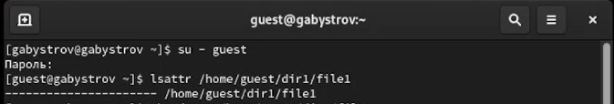
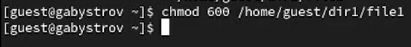
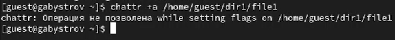
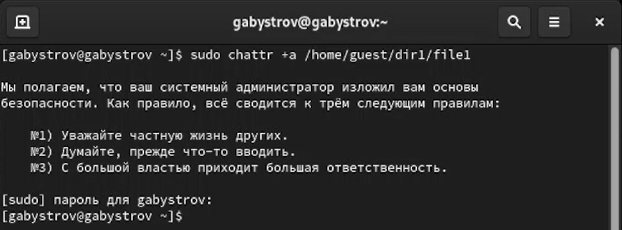
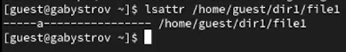
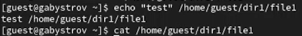
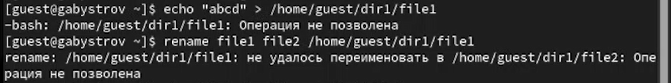
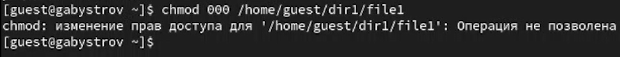
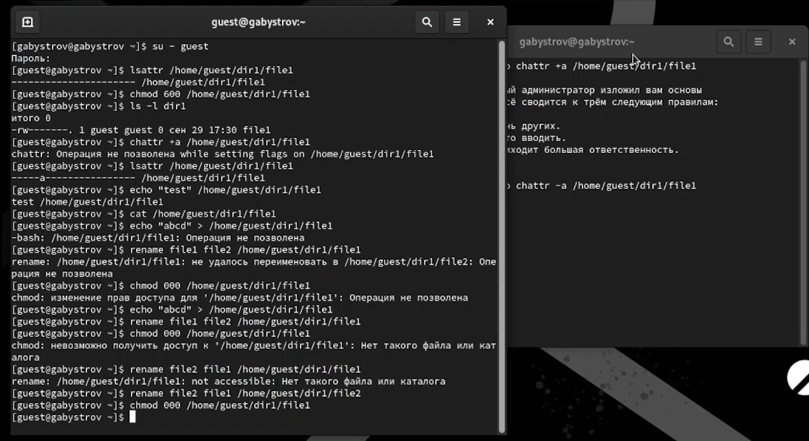
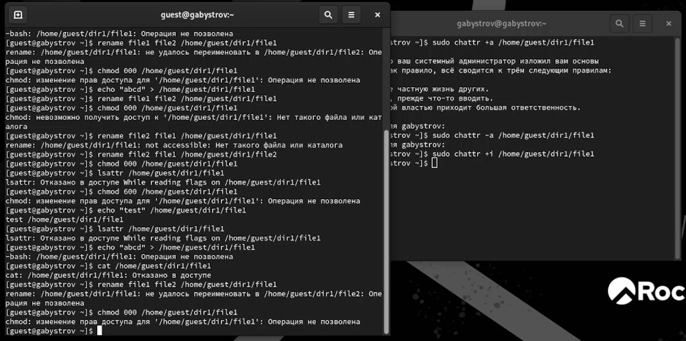

---
## Front matter
lang: ru-RU
title: Отчёт по лабораторной работе №4
author: |
	Быстров Г. А.
institute: |
	Российский университет дружбы народов, Москва, Россия
date: 30 сентября 2023

## Formatting
toc: false
slide_level: 2
theme: metropolis
header-includes: 
 - \metroset{progressbar=frametitle,sectionpage=progressbar,numbering=fraction}
 - '\makeatletter'
 - '\beamer@ignorenonframefalse'
 - '\makeatother'
aspectratio: 43
section-titles: true
---

## Прагматика

- научиться взаимодействовать с расширенными атрибутами;
- получить практические знания работы с ОС Linux;
- решить возникающие трудности и проблемы;
- практически получить полезный результат.

## Цель работы

Получить практические навыки работы в консоли с расширенными атрибутами файлов.

## Задачи

1. От имени пользователя guest определите расширенные атрибуты файла (рис. \ref{1}).

{ width=70% }

## Задачи

2. Установите на файл file1 права, разрешающие чтение и запись для владельца файла (рис. \ref{2}).

{ width=70% }

## Задачи

3. Попробовал установить на файл /home/guest/dir1/file1 расширенный атрибут a от имени пользователя guest (рис. \ref{3}).

{ width=70% }

## Задачи

4. Повысил свои права с помощью команды su. Попробовал установить расширенный атрибут a на файл /home/guest/dir1/file1 от имени суперпользователя (рис. \ref{4}).

{ width=70% }

## Задачи

5. От пользователя guest проверил правильность установления атрибута (рис. \ref{5}).

{ width=70% }

## Задачи

6. Выполнил дозапись в файл file1 слова «test» (рис. \ref{6}).

{ width=70% }

## Задачи

7. Попробовал удалить файл file1 либо стереть имеющуюся в нём информацию (рис. \ref{7}).

{ width=70% }

## Задачи

8. Попробовал с помощью команды установить на файл file1 права, например, запрещающие чтение и запись для владельца файла (рис. \ref{8}).

{ width=70% }

## Задачи

9. Снял расширенный атрибут a с файла /home/guest/dirl/file1 от имени суперпользователя. Повторил операции, которые  ранее не удавалось выполнить (рис. \ref{9}).

{ width=70% }

## Задачи

10. Повторил действия по шагам, заменив атрибут «a» атрибутом «i». Проверил можно ли дозаписать информацию в файл (рис. \ref{10}).

{ width=70% }

## Результаты

- получил практические навыкы работы в консоли с расширенными атрибутами файлов.