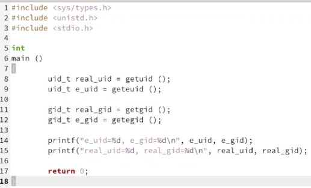
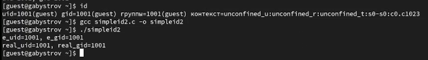
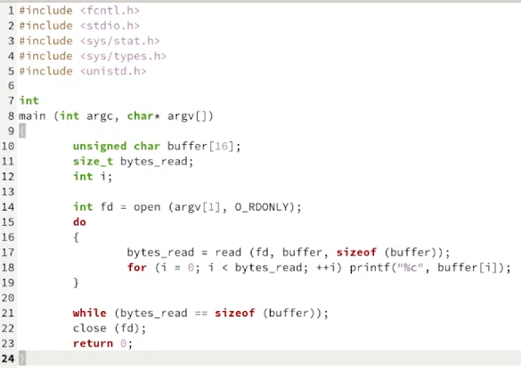
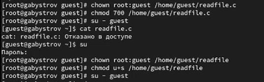
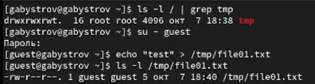
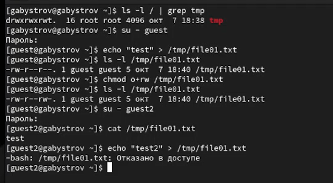
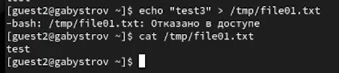
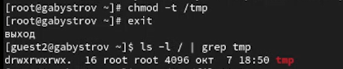
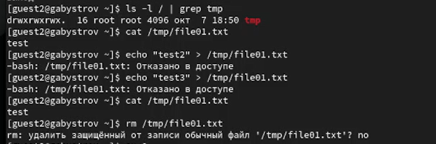
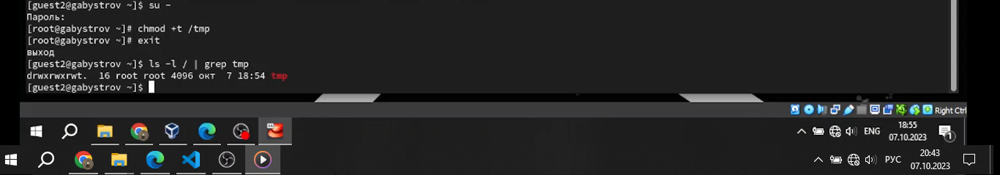

---
## Front matter
lang: ru-RU
title: Отчёт по лабораторной работе №5
author: |
	Быстров Г. А.
institute: |
	Российский университет дружбы народов, Москва, Россия
date: 7 октября 2023

## Formatting
toc: false
slide_level: 2
theme: metropolis
header-includes: 
 - \metroset{progressbar=frametitle,sectionpage=progressbar,numbering=fraction}
 - '\makeatletter'
 - '\beamer@ignorenonframefalse'
 - '\makeatother'
aspectratio: 43
section-titles: true
---

## Прагматика

- научиться взаимодействовать с механизмами изменения идентификаторов, применения SetUID- и Sticky-битов;
- получить практические знания работы с ОС Linux;
- решить возникающие трудности и проблемы;
- практически получить полезный результат.

## Цель работы

Изучить механизмы изменения идентификаторов, применения SetUID- и Sticky-битов. Получить практические навыки работы в консоли с дополнительными атрибутами. Рассмотреть работу механизма смены идентификатора процессов пользователей, а также влияние бита Sticky на запись и удаление файлов.

## Задачи

1. Создал программу simpleid.c и simpleid2.c (рис. \ref{1}).

{ width=70% }

## Задачи

2. От имени суперпользователя выполнил команды: chown root:guest /home/guest/simpleid2 chmod u+s /home/guest/simpleid2. Запустил simpleid2 и id и сравнил результаты (рис. \ref{2}).

{ width=70% }

## Задачи

3. Создайл программу readfile.c (рис. \ref{3}).

{ width=70% }

## Задачи

4. Сменил владельца у файла readfile.c (или любого другого текстового файла в системе) и изменил права так, чтобы только суперпользователь
(root) мог прочитать его, a guest не мог (рис. \ref{4}).

{ width=70% }

## Задачи

5. От имени пользователя guest создал файл file01.txt в директории /tmp со словом test (рис. \ref{5}).

{ width=70% }

## Задачи

6. Просмотрел атрибуты у только что созданного файла и разрешил чтение и запись для категории пользователей «все остальные» (рис. \ref{6}).

{ width=70% }

## Задачи

7. От пользователя guest2 попробовал записать в файл /tmp/file01.txt слова test2 и test3, стерев при этом всю имеющуюся в файле информацию (рис. \ref{7}).

{ width=70% }

## Задачи

8. Повысил свои права до суперпользователя следующей командой su - и выполнил после этого команду, снимающую атрибут t (Sticky-бит) с
директории /tmp: chmod -t /tmp (рис. \ref{8}).

{ width=70% }

## Задачи

9. От пользователя guest2 проверил, что атрибута t у директории /tmp нет: ls -l / | grep tmp. Повторил предыдущие шаги. (рис. \ref{9}).

{ width=70% }

## Задачи

10. Повысил свои права до суперпользователя и верните атрибут t на директорию /tmp (рис. \ref{10}).

{ width=70% }

## Результаты

- изучил механизмы изменения идентификаторов, применения SetUID- и Sticky-битов;
- получил практические навыки работы в консоли с дополнительными атрибутами;
- рассмотрел работу механизма смены идентификатора процессов пользователей, а также влияние бита Sticky на запись и удаление файлов.