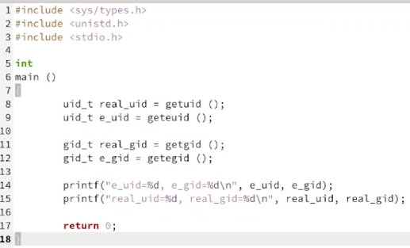
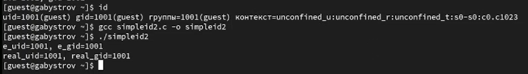
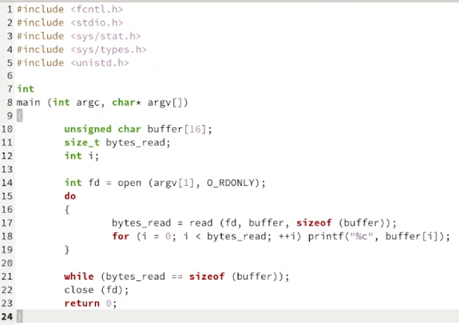
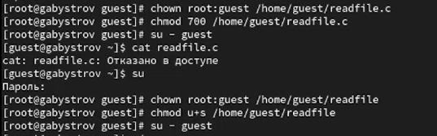
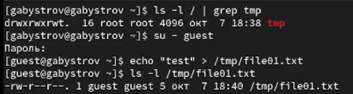
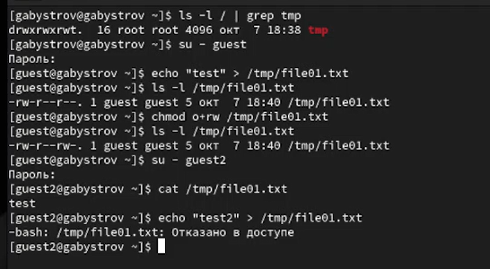
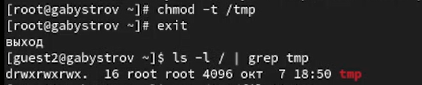
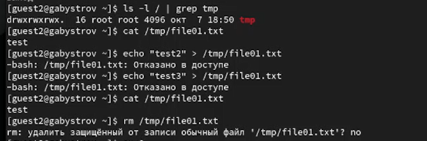
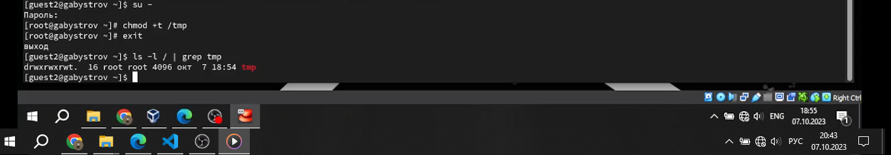

---
## Front matter
title: "Отчёт по лабораторной работе №5"
subtitle: "дисциплина: Информационная безопасность"
author: "Быстров Глеб Андреевич"

## Generic otions
lang: ru-RU
toc-title: "Содержание"

## Bibliography
bibliography: bib/cite.bib
csl: pandoc/csl/gost-r-7-0-5-2008-numeric.csl

## Pdf output format
toc: true # Table of contents
toc-depth: 2
lof: true # List of figures
lot: true # List of tables
fontsize: 12pt
linestretch: 1.5
papersize: a4
documentclass: scrreprt
## I18n polyglossia
polyglossia-lang:
  name: russian
  options:
	- spelling=modern
	- babelshorthands=true
polyglossia-otherlangs:
  name: english
## I18n babel
babel-lang: russian
babel-otherlangs: english
## Fonts
mainfont: PT Serif
romanfont: PT Serif
sansfont: PT Sans
monofont: PT Mono
mainfontoptions: Ligatures=TeX
romanfontoptions: Ligatures=TeX
sansfontoptions: Ligatures=TeX,Scale=MatchLowercase
monofontoptions: Scale=MatchLowercase,Scale=0.9
## Biblatex
biblatex: true
biblio-style: "gost-numeric"
biblatexoptions:
  - parentracker=true
  - backend=biber
  - hyperref=auto
  - language=auto
  - autolang=other*
  - citestyle=gost-numeric
## Pandoc-crossref LaTeX customization
figureTitle: "Рис."
tableTitle: "Таблица"
listingTitle: "Листинг"
lofTitle: "Список иллюстраций"
lotTitle: "Список таблиц"
lolTitle: "Листинги"
## Misc options
indent: true
header-includes:
  - \usepackage{indentfirst}
  - \usepackage{float} # keep figures where there are in the text
  - \floatplacement{figure}{H} # keep figures where there are in the text
---

# Цель работы

В данной лабораторной работе мне будет необходимо изучить механизмы изменения идентификаторов, применения SetUID- и Sticky-битов. Получить практические навыки работы в консоли с дополнительными атрибутами. Рассмотреть работу механизма смены идентификатора процессов пользователей, а также влияние бита Sticky на запись и удаление файлов.

# Задание

Последовательно выполнить пункты в терминале Linux.

# Теоретическое введение

В Linux у каждого файла и каждого каталога есть два владельца: пользователь и группа.

Эти владельцы устанавливаются при создании файла или каталога. Пользователь, который создаёт файл становится владельцем этого файла, а первичная группа, в которую входит этот же пользователь, так же становится владельцем этого файла. Чтобы определить, есть ли у вас как у пользователя права доступа к файлу или каталогу, оболочка проверяет владение ими. [@key-1].

Выделяют три категории пользователей, которым могут предоставляться права на файл:

* Сам владелец (u – user) объекта – конкретный пользователь, чье имя числится в атрибутах файла как имя владельца этого файла. Обычно если пользователь создает файл, то он автоматически записывается как его владелец.

* Группа (g – group), к которой принадлежит владелец файла. Когда в Linux создается пользователь, то для него создается одноименная группа. Однако средствами администрирования системы можно объединять пользователей в различные группы. При этом конкретный пользователь может входить в состав нескольких групп. Группы позволяют предоставлять права доступа к ресурсам сразу нескольким людям, но при этом ограниченному кругу лиц.

* Все остальные (o – other) – это все те, кто не является владельцем файла и не принадлежит к группе владельца файла. То есть любой посторонний пользователь. 

Чтение, запись, выполнение – это то, что можно делать с существующим файлом, возможные действия над ним. У каждой категории пользователей (владельца, группы, остальных) должны быть свои права на каждое вышеупомянутое действие.

* Право на чтение (r – read) означает, что файл можно просматривать. Например, открыть файл и, если он текстовый, прочитать содержащийся в нем текст. Если это файл изображения, то можно посмотреть изображение. Наличие права только на чтение не позволяет изменять файл. То есть нельзя будет исправить текст или подрисовать что-то к картинке.

* Право на запись (w – write) позволяет изменять файл, то есть дописывать в него информацию или заменять ее другой.

* Право на исполнение (x – execution) имеет смысл не для всех файлов, хотя может быть установлено для любого. Это право позволяет исполнять файл как программу, при этом в файле должны быть записаны инструкции для процессора, то есть файл должен быть исполняемой программой.

Первые три записи – это права владельца, вторые три записи – права группы, последняя тройка – права на файл для всех остальных. Если обозначить каждое право соответствующей буквой, и все права всем предоставляются, то получится такая запись: rwxrwxrwx [@key-2].

Рассмотрим подробнее, что значат условные значения флагов прав:

--- - нет прав, совсем;

--x - разрешено только выполнение файла, как программы но не изменение и не чтение;

-w- - разрешена только запись и изменение файла;

-wx - разрешено изменение и выполнение, но в случае с каталогом, вы не можете посмотреть его содержимое;

r-- - права только на чтение;

r-x - только чтение и выполнение, без права на запись;

rw- - права на чтение и запись, но без выполнения;

rwx - все права;

--s - установлен SUID или SGID бит, первый отображается в поле для владельца, второй для группы;

--t - установлен sticky-bit, а значит пользователи не могут удалить этот файл [@key-3].

Использование команды ls с опцией -l выведет на экран «длинную» распечатку, в которой будут, среди прочего, отражены права доступа к файлу [@key-4].

Все группы, созданные в системе, находятся в файле /etc/group. Посмотрев содержимое этого файла, вы можете узнать список групп linux, которые уже есть в вашей системе.

Кроме стандартных root и users, здесь есть еще пару десятков групп. Это группы, созданные программами, для управления доступом этих программ к общим ресурсам. Каждая группа разрешает чтение или запись определенного файла или каталога системы, тем самым регулируя полномочия пользователя, а следовательно, и процесса, запущенного от этого пользователя. Здесь можно считать, что пользователь - это одно и то же что процесс, потому что у процесса все полномочия пользователя, от которого он запущен [@key-5]. 

Расширенные атрибуты файловых объектов (далее - расширенные атрибуты) - поддерживаемая некоторыми файловыми системами возможность ассоциировать с файловыми объектами произвольные метаданные. В отличие от обычных атрибутов файловых объектов (таких, как владелец, права доступа, время создания и пр.), содержание расширенных атрибутов не специфицируется в файловой системе и может принимать любые значение. С точки зрения реализации расширенные атрибуты представляют собой пары ключ:значение, ассоциированные с файловыми объектами. Типичными применениями расширенных атрибутов является хранение таких данных, как автор документа, контрольные суммы, источник документа, информация для контроля доступа [@key-6].

Есть три бита – Setuid, Setgid и Sticky Bit. Это специальные типы разрешений позволяют задавать расширенные права доступа на файлы или каталоги.

Setuid – это бит разрешения, который позволяет пользователю запускать исполняемый файл с правами владельца этого файла. Другими словами, использование этого бита позволяет нам поднять привилегии пользователя в случае, если это необходимо. Классический пример использования этого бита в операционной системе это команда sudo [@key-7]. 

Принцип работы Setgid очень похож на setuid с отличием, что файл будет запускаться пользователем от имени группы, которая владеет файлом [@key-7].

Последний специальный бит разрешения – это Sticky Bit . В случае, если этот бит установлен для папки, то файлы в этой папке могут быть удалены только их владельцем. Пример использования этого бита в операционной системе это системная папка /tmp . Эта папка разрешена на запись любому пользователю, но удалять файлы в ней могут только пользователи, являющиеся владельцами этих файлов [@key-7].

# Выполнение лабораторной работы

1. Создал программу simpleid.c и simpleid2.c (рис. @fig:001).

{ #fig:001 width=70%}

2. От имени суперпользователя выполнил команды: chown root:guest /home/guest/simpleid2 chmod u+s /home/guest/simpleid2. Запустил simpleid2 и id и сравнил результаты (рис. @fig:002).

{ #fig:002 width=70%}

3. Создайл программу readfile.c (рис. @fig:003).

{ #fig:003 width=70%}

4. Сменил владельца у файла readfile.c (или любого другого текстового файла в системе) и изменил права так, чтобы только суперпользователь
(root) мог прочитать его, a guest не мог (рис. @fig:004).

{ #fig:004 width=70%}

5. От имени пользователя guest создал файл file01.txt в директории /tmp со словом test (рис. @fig:005).

{ #fig:005 width=70%}

6. Просмотрел атрибуты у только что созданного файла и разрешил чтение и запись для категории пользователей «все остальные» (рис. @fig:006).

{ #fig:006 width=70%}

7. От пользователя guest2 попробовал записать в файл /tmp/file01.txt слова test2 и test3, стерев при этом всю имеющуюся в файле информацию (рис. @fig:007).

{ #fig:007 width=70%}

8. Повысил свои права до суперпользователя следующей командой su - и выполнил после этого команду, снимающую атрибут t (Sticky-бит) с
директории /tmp: chmod -t /tmp (рис. @fig:008).

{ #fig:008 width=70%}

9. От пользователя guest2 проверил, что атрибута t у директории /tmp нет: ls -l / | grep tmp. Повторил предыдущие шаги. (рис. @fig:009).

{ #fig:009 width=70%}

10. Повысил свои права до суперпользователя и верните атрибут t на директорию /tmp (рис. @fig:010).

{ #fig:010 width=70%}

# Выводы

В данной лабораторной работе мне успешно удалось изучить механизмы изменения идентификаторов, применения SetUID- и Sticky-битов. Получить практические навыки работы в консоли с дополнительными атрибутами. Рассмотреть работу механизма смены идентификатора процессов пользователей, а также влияние бита Sticky на запись и удаление файлов.

# Список литературы{.unnumbered}

::: {#refs}
:::
