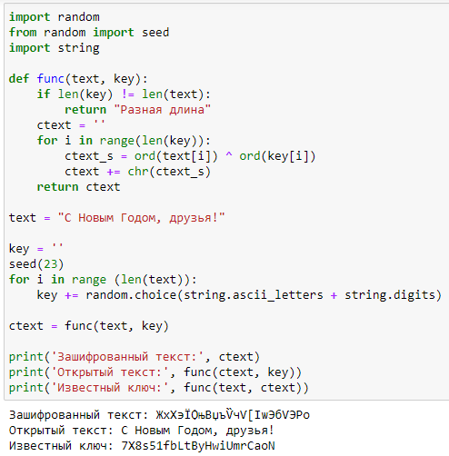

---
## Front matter
lang: ru-RU
title: Отчёт по лабораторной работе №7
author: |
	Быстров Г. А.
institute: |
	Российский университет дружбы народов, Москва, Россия
date: 21 октября 2023

## Formatting
toc: false
slide_level: 2
theme: metropolis
header-includes: 
 - \metroset{progressbar=frametitle,sectionpage=progressbar,numbering=fraction}
 - '\makeatletter'
 - '\beamer@ignorenonframefalse'
 - '\makeatother'
aspectratio: 43
section-titles: true
---

## Прагматика

- получить практические знания реализации режима однократного гаммирования;
- решить возникающие трудности и проблемы;
- практически получить полезный результат.

## Цель работы

Разработать приложение, позволяющее шифровать и дешифровать данные в режиме однократного гаммирования

## Задачи

1. Реализовал на языке Python программу (рис. \ref{1}).

{ width=70% }

## Результаты

- получил практические навыки для реализации режима однократного гаммирования.