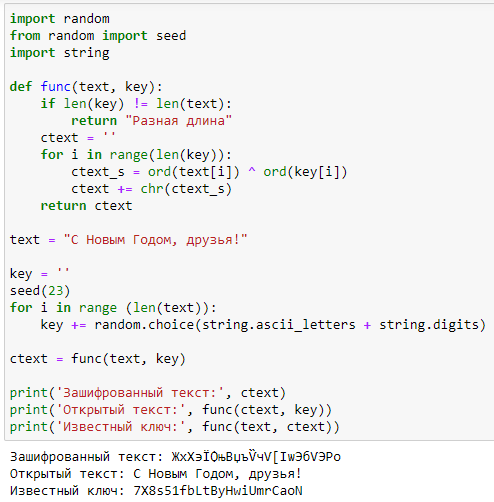

---
## Front matter
title: "Отчёт по лабораторной работе №7"
subtitle: "дисциплина: Информационная безопасность"
author: "Быстров Глеб Андреевич"

## Generic otions
lang: ru-RU
toc-title: "Содержание"

## Bibliography
bibliography: bib/cite.bib
csl: pandoc/csl/gost-r-7-0-5-2008-numeric.csl

## Pdf output format
toc: true # Table of contents
toc-depth: 2
lof: true # List of figures
lot: true # List of tables
fontsize: 12pt
linestretch: 1.5
papersize: a4
documentclass: scrreprt
## I18n polyglossia
polyglossia-lang:
  name: russian
  options:
	- spelling=modern
	- babelshorthands=true
polyglossia-otherlangs:
  name: english
## I18n babel
babel-lang: russian
babel-otherlangs: english
## Fonts
mainfont: PT Serif
romanfont: PT Serif
sansfont: PT Sans
monofont: PT Mono
mainfontoptions: Ligatures=TeX
romanfontoptions: Ligatures=TeX
sansfontoptions: Ligatures=TeX,Scale=MatchLowercase
monofontoptions: Scale=MatchLowercase,Scale=0.9
## Biblatex
biblatex: true
biblio-style: "gost-numeric"
biblatexoptions:
  - parentracker=true
  - backend=biber
  - hyperref=auto
  - language=auto
  - autolang=other*
  - citestyle=gost-numeric
## Pandoc-crossref LaTeX customization
figureTitle: "Рис."
tableTitle: "Таблица"
listingTitle: "Листинг"
lofTitle: "Список иллюстраций"
lotTitle: "Список таблиц"
lolTitle: "Листинги"
## Misc options
indent: true
header-includes:
  - \usepackage{indentfirst}
  - \usepackage{float} # keep figures where there are in the text
  - \floatplacement{figure}{H} # keep figures where there are in the text
---

# Цель работы

В данной лабораторной работе мне будет необходимо освоить на практике применение режима однократного гаммированияи.

# Задание

Нужно подобрать ключ, чтобы получить сообщение «С Новым Годом, друзья!». Требуется разработать приложение, позволяющее шифровать и дешифровать данные в режиме однократного гаммирования. Приложение должно:

1. Определить вид шифротекста при известном ключе и известном открытом тексте.

2. Определить ключ, с помощью которого шифротекст может быть преобразован в некоторый фрагмент текста, представляющий собой один из возможных вариантов прочтения открытого текста.

# Теоретическое введение

Гамми́рование, или Шифр XOR, — метод симметричного шифрования, заключающийся в «наложении» последовательности, состоящей из случайных чисел, на открытый текст. Последовательность случайных чисел называется гамма-последовательностью и используется для зашифровывания и расшифровывания данных. Суммирование обычно выполняется в каком-либо конечном поле. Например, в поле Галуа GF(2) суммирование принимает вид операции «исключающее ИЛИ (XOR)». [@key-1].

Симметричное шифрование - это метод шифрования, при котором для защиты информации используется ключ, зная который любой может расшифровать или зашифровать данные.

Алгоритмы с симметричными ключами имеют очень высокую производительность. Криптография с симметричными ключами стойкая, что делает практически невозможным процесс дешифрования без знания ключа. При прочих равных условиях стойкость определяется длиной ключа. Так как для шифрования и дешифрования используется один и тот же ключ, при использовании таких алгоритмов требуются высоко надежные механизмы для распределения ключей. Ещё одна проблемой является безопасное распространение симметричных ключей. Алгоритмы симметричного шифрования используют ключи не очень большой длины и могут быстро шифровать большие объемы данных.

Гаммированием (gamma xoring) называется процесс «наложения» гамма-последовательности на открытые данные. Обычно это суммирование по какому-либо модулю, например, по модулю два, такое суммирование принимает вид обычного «исключающего ИЛИ» суммирования.

Симметричное шифрование остаётся самым актуальным и криптографически гарантированными методом защиты информации. В симметричном шифровании, основанном на использовании составных ключей, идея состоит в том, что секретный ключ делится на две части, хранящиеся отдельно. Каждая часть сама по себе не позволяет выполнить дешифрование [@key-2].

# Выполнение лабораторной работы

1. Реализовал на языке Python программу для выполнения задания (рис. @fig:001).

{ #fig:001 width=70%}

Этот код выполняет операцию шифрования и дешифрования текста с использованием операции исключающего ИЛИ (XOR) между каждым символом в исходном тексте и ключе. Вот, как работает код:

Сначала код импортирует необходимые модули:

* random: для генерации случайных символов.

* seed: для установки начального значения генератора случайных чисел, чтобы можно было воспроизводить результат.

* string: для доступа к наборам символов (букв и цифр).

Затем определена функция func, которая принимает два аргумента: text и key.

В функции func проверяется, равны ли длины text и key. Если они не равны, функция возвращает строку "Разная длина".

Далее в цикле происходит шифрование каждой пары символов из text и key. Для этого:

* Символы из text и key преобразуются в их числовые коды с помощью функции ord.

* Затем выполняется операция XOR (^) между числовыми кодами символов, и результат записывается в переменную ctext_s.

* Полученный код символа ctext_s преобразуется обратно в символ с помощью функции chr.
* Зашифрованный символ добавляется к строке ctext.

Функция func возвращает строку ctext после завершения шифрования.

Затем определены исходный текст text и ключ key. Ключ генерируется следующим образом:

* Устанавливается начальное значение генератора случайных чисел с помощью seed(23), чтобы результаты были воспроизводимы.

* В цикле создается ключ, добавляя к нему случайные символы из множества букв и цифр.

Далее вызывается функция func с исходным текстом и ключом для зашифровки текста, и зашифрованный текст сохраняется в переменной ctext.

На экран выводится зашифрованный текст с помощью print.

Затем вызывается функция func дважды для дешифровки текста:

* Первый раз с зашифрованным текстом и ключом.

* Второй раз с исходным текстом и зашифрованным текстом.

Расшифрованный текст и исходный текст снова выводятся на экран с помощью print.

# Выводы

В данной лабораторной работе мне успешно удалось освоить на практике применение режима однократного гаммированияи.

# Список литературы{.unnumbered}

::: {#refs}
:::
