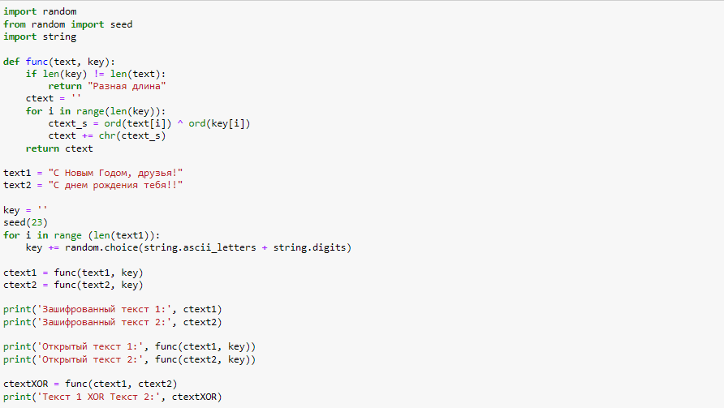
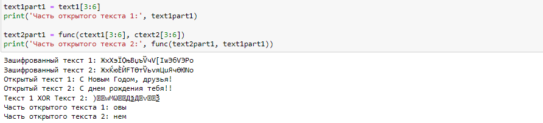

---
## Front matter
title: "Отчёт по лабораторной работе №8"
subtitle: "дисциплина: Информационная безопасность"
author: "Быстров Глеб Андреевич"

## Generic otions
lang: ru-RU
toc-title: "Содержание"

## Bibliography
bibliography: bib/cite.bib
csl: pandoc/csl/gost-r-7-0-5-2008-numeric.csl

## Pdf output format
toc: true # Table of contents
toc-depth: 2
lof: true # List of figures
lot: true # List of tables
fontsize: 12pt
linestretch: 1.5
papersize: a4
documentclass: scrreprt
## I18n polyglossia
polyglossia-lang:
  name: russian
  options:
	- spelling=modern
	- babelshorthands=true
polyglossia-otherlangs:
  name: english
## I18n babel
babel-lang: russian
babel-otherlangs: english
## Fonts
mainfont: PT Serif
romanfont: PT Serif
sansfont: PT Sans
monofont: PT Mono
mainfontoptions: Ligatures=TeX
romanfontoptions: Ligatures=TeX
sansfontoptions: Ligatures=TeX,Scale=MatchLowercase
monofontoptions: Scale=MatchLowercase,Scale=0.9
## Biblatex
biblatex: true
biblio-style: "gost-numeric"
biblatexoptions:
  - parentracker=true
  - backend=biber
  - hyperref=auto
  - language=auto
  - autolang=other*
  - citestyle=gost-numeric
## Pandoc-crossref LaTeX customization
figureTitle: "Рис."
tableTitle: "Таблица"
listingTitle: "Листинг"
lofTitle: "Список иллюстраций"
lotTitle: "Список таблиц"
lolTitle: "Листинги"
## Misc options
indent: true
header-includes:
  - \usepackage{indentfirst}
  - \usepackage{float} # keep figures where there are in the text
  - \floatplacement{figure}{H} # keep figures where there are in the text
---

# Цель работы

В данной лабораторной работе мне будет необходимо освоить на практике применение режима однократного гаммированияи.

# Задание

Два текста кодируются одним ключом (однократное гаммирование).
Требуется не зная ключа и не стремясь его определить, прочитать оба текста. Необходимо разработать приложение, позволяющее шифровать и дешифровать тексты P1 и P2 в режиме однократного гаммирования. Приложение должно определить вид шифротекстов C1 и C2 обоих текстов P1 и
P2 при известном ключе; Необходимо определить и выразить аналитически способ, при котором злоумышленник может прочитать оба текста, не
зная ключа и не стремясь его определить.

# Теоретическое введение

Гамми́рование, или Шифр XOR, — метод симметричного шифрования, заключающийся в «наложении» последовательности, состоящей из случайных чисел, на открытый текст. Последовательность случайных чисел называется гамма-последовательностью и используется для зашифровывания и расшифровывания данных. Суммирование обычно выполняется в каком-либо конечном поле. Например, в поле Галуа GF(2) суммирование принимает вид операции «исключающее ИЛИ (XOR)». [@key-1].

Симметричное шифрование - это метод шифрования, при котором для защиты информации используется ключ, зная который любой может расшифровать или зашифровать данные.

Алгоритмы с симметричными ключами имеют очень высокую производительность. Криптография с симметричными ключами стойкая, что делает практически невозможным процесс дешифрования без знания ключа. При прочих равных условиях стойкость определяется длиной ключа. Так как для шифрования и дешифрования используется один и тот же ключ, при использовании таких алгоритмов требуются высоко надежные механизмы для распределения ключей. Ещё одна проблемой является безопасное распространение симметричных ключей. Алгоритмы симметричного шифрования используют ключи не очень большой длины и могут быстро шифровать большие объемы данных.

Гаммированием (gamma xoring) называется процесс «наложения» гамма-последовательности на открытые данные. Обычно это суммирование по какому-либо модулю, например, по модулю два, такое суммирование принимает вид обычного «исключающего ИЛИ» суммирования.

Симметричное шифрование остаётся самым актуальным и криптографически гарантированными методом защиты информации. В симметричном шифровании, основанном на использовании составных ключей, идея состоит в том, что секретный ключ делится на две части, хранящиеся отдельно. Каждая часть сама по себе не позволяет выполнить дешифрование [@key-2].

# Выполнение лабораторной работы

1. Реализовал на языке Python программу для выполнения задания (рис. @fig:001).

{ #fig:001 width=70%}

{ #fig:001 width=70%}

Этот код на Python реализует простой алгоритм шифрования и дешифрования текста с использованием операции XOR (исключающее ИЛИ) между символами текста и ключом. 

Генерация ключа:

* Программа создает случайную последовательность символов, состоящую из букв латинского алфавита (верхнего и нижнего регистра) и цифр.

* Длина этой последовательности соответствует длине исходных текстов text1 и text2.

* Этот ключ используется для шифрования и дешифрования текста.

Шифрование текста:

* Для каждого символа в исходном тексте (text1 и text2) и соответствующего символа в ключе выполняется операция XOR (^), в результате чего получается новый символ.

* Полученные символы объединяются в строку, которая представляет зашифрованный текст (ctext1 и ctext2).

Дешифрование текста:

* Та же операция XOR выполняется между зашифрованным текстом (ctext1 и ctext2) и ключом для восстановления исходного текста.

Вывод результата:

* Программа выводит зашифрованный текст ctext1 и ctext2, а затем восстанавливает исходные тексты и выводит их (Открытый текст 1 и Открытый текст 2).

* Также программа выполняет операцию XOR между зашифрованными текстами ctext1 и ctext2 и выводит результат (Текст 1 XOR Текст 2).

* Наконец, программа берет часть исходного текста text1 и выводит ее (Часть открытого текста 1) и также дешифрует и выводит соответствующую часть из text2 (Часть открытого текста 2).

# Контрольные вопросы

1. Зная один из текстов (P1 или P2) и не зная ключа, можно вычислить другой текст, применяя операцию XOR к известному тексту и зашифрованному тексту с использованием того же самого ключа. Это происходит в части кода, где выполняется дешифрование: `func(ctext1, key)` и `func(ctext2, key)`.

2. При повторном использовании одного и того же ключа для шифрования текстовых данных возникают проблемы с безопасностью. При XOR-шифровании, если один и тот же ключ используется для нескольких текстов, и если атакующий получит доступ к двум зашифрованным текстам, это может привести к раскрытию обоих исходных текстов с использованием операции XOR между ними.

3. Режим шифрования однократного гаммирования (One-Time Pad, OTP) реализуется с использованием одного ключа для шифрования двух открытых текстов. В этом режиме каждый из двух открытых текстов XOR-шифруется с тем же самым ключом.

4. Недостатки шифрования одним ключом двух открытых текстов (режим шифрования однократного гаммирования) включают в себя:

* Необходимость использования ключей, длина которых равна длине самих текстов, что делает ключи очень длинными и труднопередаваемыми.

* Очень важно, чтобы ключи были случайными и использовались только один раз для каждой пары открытых текстов. В противном случае шифр становится уязвимым.

* Отсутствие надежного способа передачи ключей. Если ключ будет скомпрометирован, все сообщения, зашифрованные с его использованием, могут быть расшифрованы.

5. Преимущества шифрования одним ключом двух открытых текстов (режим шифрования однократного гаммирования):

* Шифр OTP считается теоретически непреодолимым (по криптографическим стандартам), если ключи случайны и используются только один раз.

* При правильной реализации шифр OTP обеспечивает максимальную стойкость к атакам, включая криптоанализ.

* Шифр OTP не имеет структуры и не предоставляет атакующему никакой информации о содержании сообщения, что делает его надежным средством шифрования.

* В случае использования ключей, генерируемых с использованием источника случайных чисел с высокой энтропией, шифр OTP может предоставить высокую стойкость к взлому.

# Выводы

В данной лабораторной работе мне успешно удалось освоить на практике применение режима однократного гаммированияи.

# Список литературы{.unnumbered}

::: {#refs}
:::
